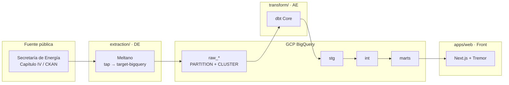
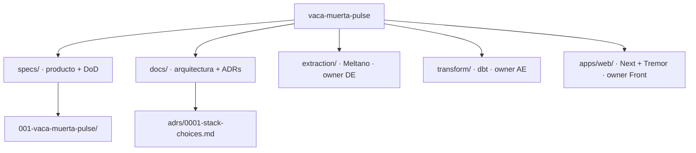

# Vaca Muerta Pulse

Dashboard público de **storytelling** sobre producción y completaciones no convencionales en **Vaca Muerta** (Cuenca Neuquina, Argentina), a partir de los datos abiertos del **Capítulo IV** de la Secretaría de Energía.

Este repo es un **data product** de portfolio, **spec-driven**: primero specs y ADRs, después Meltano / dbt / Next.

> **Hito 0 (este árbol):** documentación y scaffolding. Todavía **no** hay Meltano, dbt ni Next implementados. Los folders `extraction/`, `transform/` y `apps/web/` son placeholders a propósito.

| Si sos… | Empezá por |
| --- | --- |
| Humano (producto / arquitectura) | este README → [specs/001](specs/001-vaca-muerta-pulse/spec.md) → [docs/architecture.md](docs/architecture.md) |
| Agente de código | [AGENTS.md](AGENTS.md) (orden de lectura obligatorio) |

---

## El problema

Los datos de Capítulo IV son **públicos y ricos**, pero malos para contar una historia:

- CSVs anuales pesados (DDJJ abiertas y cerradas), publicados en [Datos Argentina](https://datos.gob.ar/dataset/energia-produccion-petroleo-gas-por-pozo-capitulo-iv) / CKAN de Energía.
- Grano poco obvio (pozo × mes, a veces por formación productiva).
- Unidades mixtas (petróleo y agua en m³, gas en miles de m³).
- Completaciones / fracturas en **otro** recurso, no siempre alineado al padrón de pozos.
- Consultas oficiales ([reporte avanzado SE](https://www.se.gob.ar/datosupstream/consulta_avanzada/reporte.php)) útiles para un pozo, no para una narrativa de cuenca.

Falta un producto que responda en minutos: *¿quién produce shale en Vaca Muerta, dónde, con qué ritmo de pozos y fracturas, y cómo cambió el último año?*

## Objetivos

1. **Ingesta barata y reproducible** de Capítulo IV hacia BigQuery (particionado + clustered).
2. **Modelo analítico** (dbt `stg` → `int` → `marts`) con granos explícitos: pozo-mes, empresa, área, completaciones.
3. **Dashboard público** (Next.js + Tremor) que narre producción no convencional y completaciones, no un dump de tablas.
4. **Costo** dentro de free/cheap-tier de GCP donde se pueda (on-demand BQ, pocos full scans).
5. **Spec-driven**: cambios grandes actualizan `specs/` y `docs/adrs/` *antes* que el código.

No-goals y métricas de éxito: [spec.md](specs/001-vaca-muerta-pulse/spec.md).

---

## Arquitectura (overview)

Detalle en [docs/architecture.md](docs/architecture.md). Decisión de stack: [ADR 0001](docs/adrs/0001-stack-choices.md).

### Flujo de datos

### Layout del repo

---

## Stack (objetivo)

| Capa | Tecnología | Dónde | Hito |
| --- | --- | --- | --- |
| Specs / docs | Markdown + Mermaid | `specs/`, `docs/` | **0 (ahora)** |
| Ingesta | Meltano | `extraction/` | 1 |
| Warehouse | BigQuery, `PARTITION` + `CLUSTER` | GCP | 1 |
| Transformación | dbt Core (`stg` → `int` → `marts`) | `transform/` | 2 |
| UI | Next.js + Tremor | `apps/web/` | 3 |
| Costo | GCP free/cheap-tier, on-demand, sin secretos en git | — | 1–3 |

---

## Roadmap

Detalle y criterios de aceptación: [plan.md](specs/001-vaca-muerta-pulse/plan.md).

| Hito | Qué | Código |
| --- | --- | --- |
| **0** Fundación SDD | Specs, ADRs, AGENTS.md, placeholders | este commit |
| **1** Raw + Meltano | CKAN/CSV → BQ `raw_*` particionado | `extraction/` |
| **2** dbt | `stg` → `int` → `marts` + tests | `transform/` |
| **3** Dashboard | Storytelling público Next + Tremor | `apps/web/` |

Checklist operativo de Hito 1 (sin tachar): [tasks.md](specs/001-vaca-muerta-pulse/tasks.md).

---

## Cómo contribuir

1. Leé [AGENTS.md](AGENTS.md) (roles, DoD, secretos) y la spec activa.
2. **SDD:** si el cambio es más que un typo, actualizá `specs/` y/o un ADR *antes* del código.
3. No implementes Meltano, dbt o Next fuera de su hito (Hito 1 / 2 / 3).
4. Nunca commitees `.env`, JSON de service accounts, ni CSVs crudos pesados.
5. Un PR = un hito o una historia acotada; el owner del folder (DE / AE / Front) debe poder revisar en aislamiento.
6. QA: aceptar contra los criterios de [plan.md](specs/001-vaca-muerta-pulse/plan.md), no contra “el código corre”.

## Índice de specs y docs

- [specs/README.md](specs/README.md) — cómo funcionan las specs
- [specs/001-vaca-muerta-pulse/spec.md](specs/001-vaca-muerta-pulse/spec.md) — problema, usuarios, requisitos
- [specs/001-vaca-muerta-pulse/plan.md](specs/001-vaca-muerta-pulse/plan.md) — hitos 0–3
- [specs/001-vaca-muerta-pulse/data-model.md](specs/001-vaca-muerta-pulse/data-model.md) — granos (draft + UNKNOWN)
- [specs/001-vaca-muerta-pulse/tasks.md](specs/001-vaca-muerta-pulse/tasks.md) — Hito 1
- [docs/architecture.md](docs/architecture.md)
- [docs/adrs/0001-stack-choices.md](docs/adrs/0001-stack-choices.md)

Placeholders de implementación: [extraction/](extraction/README.md) · [transform/](transform/README.md) · [apps/web/](apps/web/README.md)
