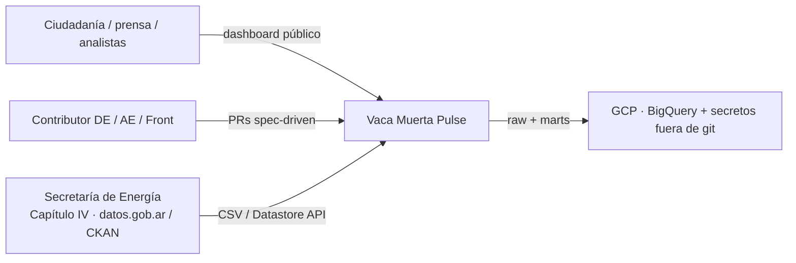
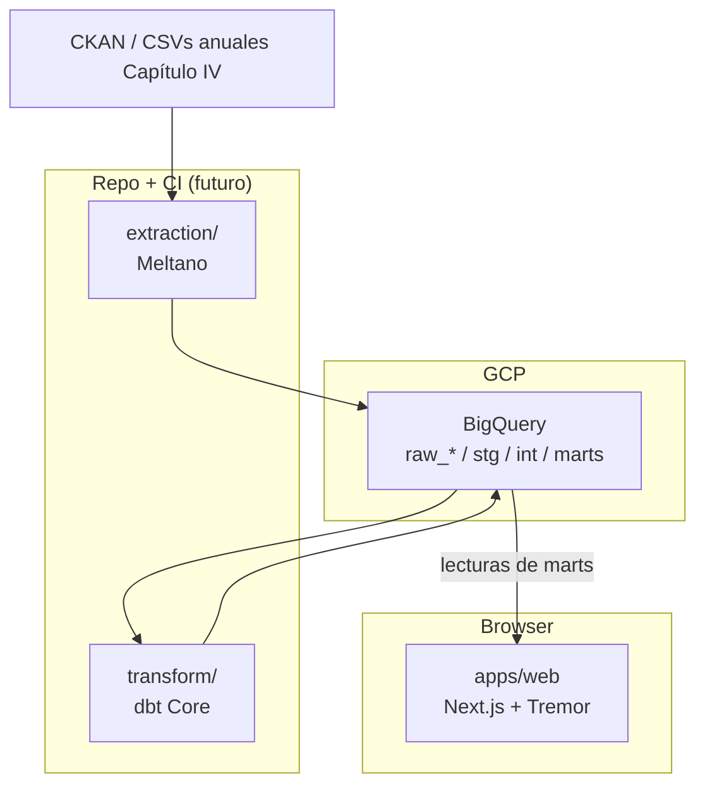
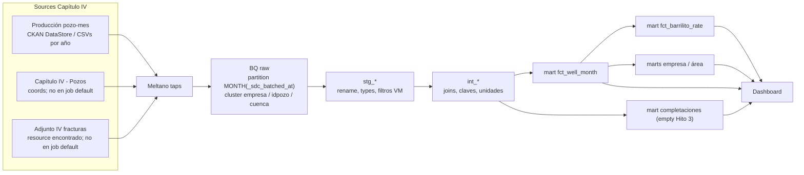

# Arquitectura — Vaca Muerta Pulse

Vista C4-ish del data product. Stack y *por qué*: [ADR 0001](adrs/0001-stack-choices.md). Producto: [spec.md](../specs/001-vaca-muerta-pulse/spec.md).

**Hoy (Hito 2, P0+P1 en `main`):** dbt Core en `transform/` sobre raw Meltano. Source primario de stg: **`raw_cap4_dev`** (`produccion_pozo_mes` `COUNT(*)` = 991844, año 2025 — handoff DE/Tutor). Prod twin: `raw_cap4`. Mart headline **`fct_barrilito_rate`**. Rankings **`fct_company_month`** / **`fct_area_month`**. SA `vm-pulse-dbt` **creada por Nico**; bindings OK. Completaciones: empty (Adjunto IV no está en el job default). Next: Hito 3.

## 1. Contexto

Quién habla con el sistema.

Límites:

- No autenticamos usuarios finales (producto público).
- No somos el origen de verdad: si SE corrige una DDJJ, re-ingerimos.
- No hay streaming; cadencia **mensual** (publicación del Capítulo IV).

## 2. Contenedores

| Contenedor | Responsabilidad | Owner |
| --- | --- | --- |
| Meltano | Extraer, no transformar negocio | DE |
| BigQuery `raw_*` | Landing fiel al source, particionado | DE |
| dbt | Tipar, granos, tests, marts de storytelling | AE |
| Next.js | Narrativa, charts, filtros | Front |

El browser **no** habla con CKAN ni con `raw_*`.

## 3. Flujo de datos (detalle)

El nodo raw del diagrama coincide con `extraction/meltano.yml`: partición **MONTH(`_sdc_batched_at`)** (no `periodo`); cluster **`empresa`, `idpozo`, `cuenca`** (no `sigla`). Intento de producto `PARTITION BY DATE(periodo)`: [extraction/sql/intended_partition.sql](../extraction/sql/intended_partition.sql).

Filtro de producto (CONFIRMED en sample 2025 DataStore; aplicar en `stg`/`int`, no en el tap): `formacion = 'vaca muerta'` y `tipo_de_recurso = 'NO CONVENCIONAL'`. Detalle en [data-model.md](../specs/001-vaca-muerta-pulse/data-model.md).

## 4. BigQuery — naming y físico (Hito 1 + datasets Hito 2)

Nombres **confirmados**. Handoff Hito 2: `raw_cap4_dev.produccion_pozo_mes` `COUNT(*)` = **991844** (año 2025). Datasets dbt `_dev` verificados 2026-09-10 (`INFORMATION_SCHEMA.SCHEMATA` + `datasets.get`). SA `vm-pulse-dbt` **creada por Nico**; bindings OK. Evidencia: [transform/docs/hito-2-bq-iam.md](../transform/docs/hito-2-bq-iam.md).

| Dataset | Contenido | Quién escribe |
| --- | --- | --- |
| `raw_cap4_dev` | **Primario Hito 2 / stg.** Tabla `produccion_pozo_mes`, `COUNT(*)` = 991844 (año 2025, handoff DE/Tutor). **append** (reload = TRUNCATE o DELETE year) | Meltano (`vm-pulse-meltano`) |
| `raw_cap4` | Twin de prod (mismo patrón de tabla; no es otro grano). **No existe todavía** | Meltano (prod, cuando se cree) |
| `stg_cap4_dev` | Staging dbt (dev). Prod twin: `stg_cap4` | dbt (`vm-pulse-dbt`) |
| `int_cap4_dev` | Intermediate dbt (dev). Prod twin: `int_cap4` | dbt (`vm-pulse-dbt`) |
| `marts_cap4_dev` | Marts dbt (dev): `fct_barrilito_rate`, `fct_well_month`, `fct_company_month`, `fct_area_month`, dims. Prod twin: `marts_cap4` | dbt (`vm-pulse-dbt`) |

Proyecto GCP: **`vaca-muerta-pulse`**. Location: **US**.

Twins prod (`stg_cap4` / `int_cap4` / `marts_cap4`) = follow-up. SA dbt: `vm-pulse-dbt` (**existe**; secret `GCP_SA_KEY_DBT`). Roles: `jobUser`, `dataViewer` en `raw_cap4_dev`, `dataEditor` en stg/int/marts. Detalle: [transform/docs/hito-2-bq-iam.md](../transform/docs/hito-2-bq-iam.md).

Tablas raw de hechos de producción (`produccion_pozo_mes`):

- Columna de período: `periodo` DATE `YYYY-MM-01` (la arma el tap desde `anio`+`mes`).
- **PARTITION intento de producto:** `PARTITION BY DATE(periodo)`.
- **PARTITION que cablea z3z1ma hoy:** MONTH sobre `_sdc_batched_at`. Pre-create: [extraction/sql/create_produccion_pozo_mes.sql](../extraction/sql/create_produccion_pozo_mes.sql). Intento producto (`periodo`): [extraction/sql/intended_partition.sql](../extraction/sql/intended_partition.sql).
- **No overwrite:** `CREATE OR REPLACE TABLE AS SELECT *` de z3z1ma @090dad06 deja `new=none` y BQ rechaza reemplazar la tabla particionada. Dev y prod hacen **append**.
- **CLUSTER BY** (orden cableado en `meltano.yml`): `empresa`, `idpozo`, `cuenca`.

Completaciones (Adjunto IV): grano evento (`id_base_fractura_adjiv`); partición candidata `fecha_inicio_fractura`. Stream en el tap, **no** seleccionado en el job default de Hito 1.

## 5. Costo y cuota (cheap/free-tier)

- BQ on-demand: ~1 TiB query/mes y 10 GiB storage en free tier. Partitions + clustering + `dbt` incremental en Hito 2 son la defensa.
- No BI Engine ni slots reservados en v1.
- Meltano corre en máquina de contributor / CI barata; no un cluster 24/7.
- Front: estático o server mínimo (Hito 3 + ADR si hay hosting).
- Presupuesto GCP y alertas: documentado en [extraction/README.md](../extraction/README.md) (budget alert 1 / 5 USD sugerido). SA write-only a `raw_*`.

## 6. Secretos

Diagrama de confianza: el SA de Meltano (`vm-pulse-meltano`) escribe `raw_*`; el SA de dbt (`vm-pulse-dbt`, **creada por Nico**) lee `raw_cap4_dev` y escribe `stg_cap4_dev` / `int_cap4_dev` / `marts_cap4_dev` (prod twins sin `_dev`). Key dbt = secret `GCP_SA_KEY_DBT` (distinto de Meltano `GCP_SA_KEY`); materializar con [transform/scripts/materialize-dbt-sa-key.sh](../transform/scripts/materialize-dbt-sa-key.sh) (rechaza `GCP_SA_KEY` a propósito). Provision/re-verify: [transform/scripts/provision_hito2_bq.sh](../transform/scripts/provision_hito2_bq.sh). El runtime del front **solo lee marts**. Ningún JSON de SA en el repo. Ver [AGENTS.md](../AGENTS.md).

## 7. Lo que no está en v1

- CDC sub-diario, Airflow/Composer, dbt Cloud, auth de usuarios, GIS pesado, cuenca fuera de Vaca Muerta como producto (el raw puede aterrizar más amplio y filtrar en `stg`).
