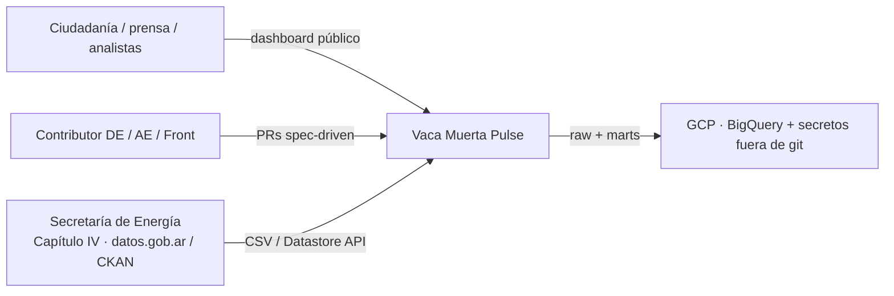
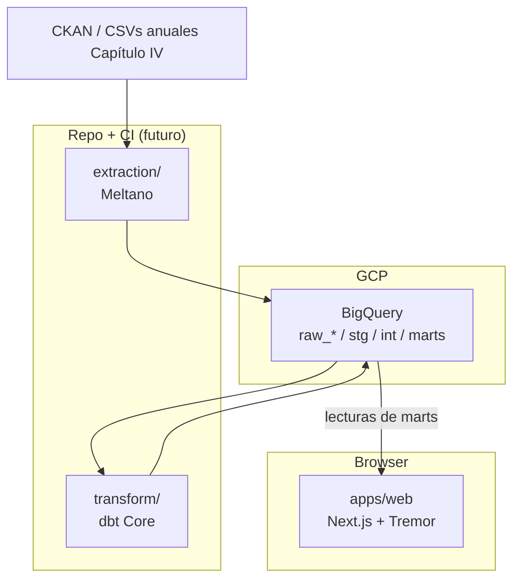
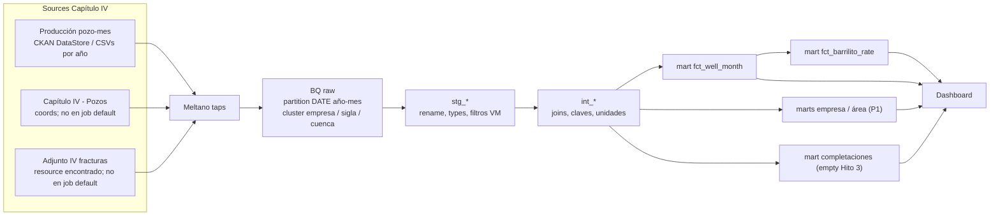

# Arquitectura — Vaca Muerta Pulse

Vista C4-ish del data product. Stack y *por qué*: [ADR 0001](adrs/0001-stack-choices.md). Producto: [spec.md](../specs/001-vaca-muerta-pulse/spec.md).

**Hoy (Hito 2):** dbt Core en `transform/` sobre raw Meltano. Source primario de stg: **`raw_cap4_dev`** (`produccion_pozo_mes` `COUNT(*)` = 991844, año 2025 — handoff DE/Tutor). Prod twin: `raw_cap4`. Mart headline **`fct_barrilito_rate`**. Next: Hito 3.

## 1. Contexto

Quién habla con el sistema.

Límites:

- No autenticamos usuarios finales (producto público).
- No somos el origen de verdad: si SE corrige una DDJJ, re-ingerimos.
- No hay streaming; cadencia **mensual** (publicación del Capítulo IV).

## 2. Contenedores

| Contenedor | Responsabilidad | Owner |
| --- | --- | --- |
| Meltano | Extraer, no transformar negocio | DE |
| BigQuery `raw_*` | Landing fiel al source, particionado | DE |
| dbt | Tipar, granos, tests, marts de storytelling | AE |
| Next.js | Narrativa, charts, filtros | Front |

El browser **no** habla con CKAN ni con `raw_*`.

## 3. Flujo de datos (detalle)

Filtro de producto (CONFIRMED en sample 2025 DataStore; aplicar en `stg`/`int`, no en el tap): `formacion = 'vaca muerta'` y `tipo_de_recurso = 'NO CONVENCIONAL'`. Detalle en [data-model.md](../specs/001-vaca-muerta-pulse/data-model.md).

## 4. BigQuery — naming y físico (Hito 1)

Nombres **confirmados como intención de DE**. Handoff Hito 2: `raw_cap4_dev.produccion_pozo_mes` `COUNT(*)` = **991844** (año 2025). Este árbol de AE no afirma `INFORMATION_SCHEMA` extra (partition/cluster siguen la evidencia Hito 1).

| Dataset | Contenido | Quién escribe |
| --- | --- | --- |
| `raw_cap4_dev` | **Primario Hito 2 / stg.** Tabla `produccion_pozo_mes`, `COUNT(*)` = 991844 (handoff DE/Tutor) | Meltano (dev) |
| `raw_cap4` | Twin de prod (mismo patrón de tabla; no es otro grano) | Meltano (prod) |
| `stg_cap4_dev` / `int_cap4_dev` / `marts_dev` (prod: sin `_dev`) | Modelos dbt | dbt (Hito 2) |

Proyecto GCP: **`vaca-muerta-pulse`**. Location: **US**.

Tablas raw de hechos de producción (`produccion_pozo_mes`):

- Columna de período: `periodo` DATE `YYYY-MM-01` (la arma el tap desde `anio`+`mes`).
- **PARTITION intento de producto:** `PARTITION BY DATE(periodo)`.
- **PARTITION que cablea z3z1ma hoy:** MONTH sobre `_sdc_batched_at`. Pre-create: [extraction/sql/create_produccion_pozo_mes.sql](../extraction/sql/create_produccion_pozo_mes.sql). Intento producto (`periodo`): [extraction/sql/intended_partition.sql](../extraction/sql/intended_partition.sql).
- **No overwrite:** `CREATE OR REPLACE TABLE AS SELECT *` de z3z1ma @090dad06 deja `new=none` y BQ rechaza reemplazar la tabla particionada. Dev y prod hacen **append**.
- **CLUSTER BY** (orden cableado en `meltano.yml`): `empresa`, `idpozo`, `cuenca`.

Completaciones (Adjunto IV): grano evento (`id_base_fractura_adjiv`); partición candidata `fecha_inicio_fractura`. Stream en el tap, **no** seleccionado en el job default de Hito 1.

## 5. Costo y cuota (cheap/free-tier)

- BQ on-demand: ~1 TiB query/mes y 10 GiB storage en free tier. Partitions + clustering + `dbt` incremental en Hito 2 son la defensa.
- No BI Engine ni slots reservados en v1.
- Meltano corre en máquina de contributor / CI barata; no un cluster 24/7.
- Front: estático o server mínimo (Hito 3 + ADR si hay hosting).
- Presupuesto GCP y alertas: documentado en [extraction/README.md](../extraction/README.md) (budget alert 1 / 5 USD sugerido). SA write-only a `raw_*`.

## 6. Secretos

Diagrama de confianza: el SA de Meltano escribe `raw_*`; el SA de dbt lee raw y escribe modelos; el runtime del front **solo lee marts** (idealmente vía vista o job de export). Ningún JSON de SA en el repo. Ver [AGENTS.md](../AGENTS.md).

## 7. Lo que no está en v1

- CDC sub-diario, Airflow/Composer, dbt Cloud, auth de usuarios, GIS pesado, cuenca fuera de Vaca Muerta como producto (el raw puede aterrizar más amplio y filtrar en `stg`).
