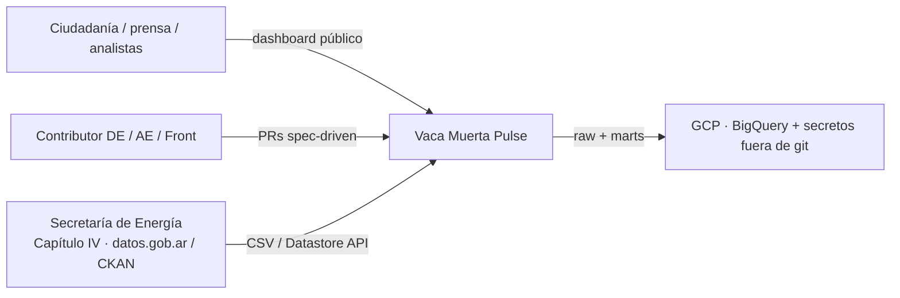
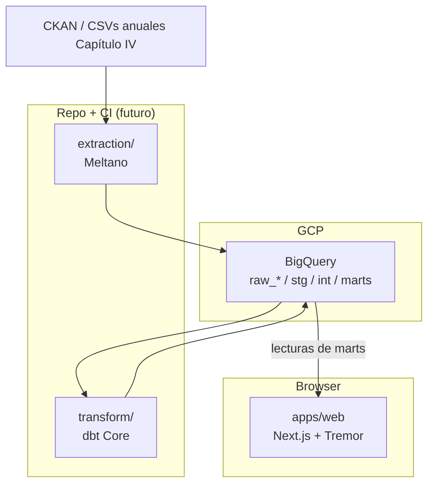
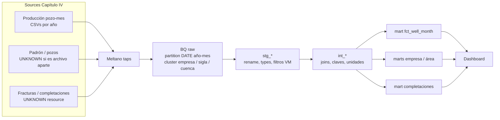

# Arquitectura — Vaca Muerta Pulse

Vista C4-ish del data product. Stack y *por qué*: [ADR 0001](adrs/0001-stack-choices.md). Producto: [spec.md](../specs/001-vaca-muerta-pulse/spec.md).

**Hoy (Hito 0):** solo este diseño. Meltano / BQ / dbt / Next se materializan en Hitos 1–3.

## 1. Contexto

Quién habla con el sistema.

Límites:

- No autenticamos usuarios finales (producto público).
- No somos el origen de verdad: si SE corrige una DDJJ, re-ingerimos.
- No hay streaming; cadencia **mensual** (publicación del Capítulo IV).

## 2. Contenedores

| Contenedor | Responsabilidad | Owner |
| --- | --- | --- |
| Meltano | Extraer, no transformar negocio | DE |
| BigQuery `raw_*` | Landing fiel al source, particionado | DE |
| dbt | Tipar, granos, tests, marts de storytelling | AE |
| Next.js | Narrativa, charts, filtros | Front |

El browser **no** habla con CKAN ni con `raw_*`.

## 3. Flujo de datos (detalle)

Filtro de producto (draft, confirmar en Hito 1): formación **Vaca Muerta** y recurso **no convencional**. Strings exactos = UNKNOWN en [data-model.md](../specs/001-vaca-muerta-pulse/data-model.md).

## 4. BigQuery — naming y físico (propuesto)

Nombres **propuestos**; Hito 1 puede ajustarlos si documenta el delta en este archivo.

| Dataset | Contenido | Quién escribe |
| --- | --- | --- |
| `raw_cap4` | Tablas 1:1 con el tap (snake_case source) | Meltano |
| `analytics` o datasets dbt `stg_cap4` / `int_cap4` / `marts` | Modelos | dbt |

Tablas raw de hechos de producción:

- **PARTITION BY** `DATE` construida desde `anio`+`mes` (o columna de fecha de declaración si el tap la trae estable). Objetivo: queries de “último año” sin full scan del histórico 2006–hoy.
- **CLUSTER BY** columnas de filtro del dashboard: p.ej. `empresa`, `sigla` / `idpozo`, `cuenca` (orden exacto = Hito 1, medir bytes).

Completaciones: si el grano es evento (no mes), particionar por `fecha_fractura` (o equivalente). Si esa columna no existe, **no inventarla** — documentar UNKNOWN y un partition proxy.

## 5. Costo y cuota (cheap/free-tier)

- BQ on-demand: ~1 TiB query/mes y 10 GiB storage en free tier. Partitions + clustering + `dbt` incremental en Hito 2 son la defensa.
- No BI Engine ni slots reservados en v1.
- Meltano corre en máquina de contributor / CI barata; no un cluster 24/7.
- Front: estático o server mínimo (Hito 3 + ADR si hay hosting).
- Presupuesto GCP y alertas: tarea de Hito 1 ([tasks.md](../specs/001-vaca-muerta-pulse/tasks.md)).

## 6. Secretos

Diagrama de confianza: el SA de Meltano escribe `raw_*`; el SA de dbt lee raw y escribe modelos; el runtime del front **solo lee marts** (idealmente vía vista o job de export). Ningún JSON de SA en el repo. Ver [AGENTS.md](../AGENTS.md).

## 7. Lo que no está en v1

- CDC sub-diario, Airflow/Composer, dbt Cloud, auth de usuarios, GIS pesado, cuenca fuera de Vaca Muerta como producto (el raw puede aterrizar más amplio y filtrar en `stg`).
