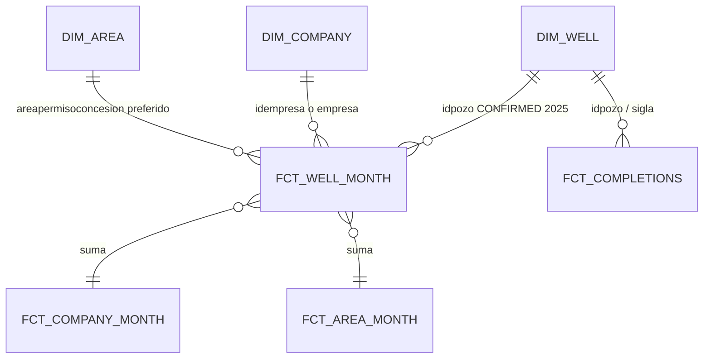

# Data model — Spec 001

Granos para Vaca Muerta Pulse. Raw Meltano = Hito 1 (`extraction/`). Marts dbt = Hito 2.

Leyenda:

- **CONFIRMED** = visto en CKAN DataStore (recurso 2025 `d774b5d7-0756-48fe-88f2-8729b57b22da` salvo que se indique otro). Dump: [`extraction/catalogs/`](../../extraction/catalogs/).
- **DRAFT** = diseño de producto; falta evidencia en warehouse / dbt.
- **UNKNOWN** = no afirmar. Cerrar en Hito 2 con tests sobre más años o marcar no-goal.

Nombres de marts (`fct_*`, `dim_*`) siguen **DRAFT**.

## Fuentes

| Recurso | Uso | Estado |
| --- | --- | --- |
| Producción pozo-mes anual, CKAN DataStore / CSV | Hecho pozo-mes | **CONFIRMED.** Package `produccion-de-petroleo-y-gas-por-pozo`. Default 2025: `d774b5d7-0756-48fe-88f2-8729b57b22da` (total Datastore 991 844 al 2026-09-10). IDs por año: [`extraction/resources/cap4.yml`](../../extraction/resources/cap4.yml) |
| Capítulo IV - Pozos `cb5c0f04-7835-45cd-b982-3e25ca7d7751` | Dim pozo + geojson | **CONFIRMED que existe.** No está en el `meltano run` default (Hito 1). Coords **no** vienen en el anual de producción |
| Padrón primera producción `5578dd48-…` | `(idpozo, anio, mes)` | **CONFIRMED** schema mínimo; no es dim completa |
| Fracturas Adjunto IV `2280ad92-6ed3-403e-a095-50139863ab0d` | Hecho de actividad | **CONFIRMED resource.** ~4890 filas. Stream en el tap, deseleccionado en Hito 1 default |
| Consulta avanzada SE (HTML) | No es source de Meltano | Fuera de diseño |

Dataset portal: [energia-produccion-petroleo-gas-por-pozo-capitulo-iv](https://datos.gob.ar/dataset/energia-produccion-petroleo-gas-por-pozo-capitulo-iv) · origen [datos.energia.gob.ar](https://datos.energia.gob.ar/dataset/produccion-de-petroleo-y-gas-por-pozo).

**Cuidado:** hay clones “con identificador” (p.ej. 2025 `6f9f63bd-…`) con Datastore **truncado** (~90k). No usarlos como extract del año.

### Campos de producción (CONFIRMED en DataStore 2025)

| Campo | Significado | Unidad / tipo CKAN |
| --- | --- | --- |
| `idpozo` | Pozo por formación productiva | integer |
| `sigla` | Identificador de boca | text |
| `anio`, `mes` | Período de la DDJJ | integer |
| `periodo` | Primer día del mes (lo agrega el tap) | DATE `YYYY-MM-01` |
| `prod_pet` | Petróleo | m³ |
| `prod_gas` | Gas | miles de m³ |
| `prod_agua` | Agua | m³ |
| `iny_agua`, `iny_gas`, `iny_co2`, `iny_otro` | Inyecciones | raw sí; marts de storytelling no (salvo agua de producción) |
| `tef` | Tiempo efectivo | **CONFIRMED plausible días** (31.0 en enero en sample no-conv; 0 en abandonados). Cast explícito en Hito 2 |
| `vida_util` | | numeric; uso Pulse = UNKNOWN |
| `empresa`, `idempresa` | Quién declara | text |
| `formprod` | Código formación productiva (p.ej. `PROS`, `FIMP`) | text |
| `formacion` | Nombre formación | text, **minúsculas** en sample (`vaca muerta`) |
| `tipo_de_recurso` | | `CONVENCIONAL` / `NO CONVENCIONAL` / `SIN RESERVORIO` / `NO DISCRIMINADO` |
| `sub_tipo_recurso` | | `SHALE` / `TIGHT` / `''` |
| `cuenca`, `provincia` | Geo admin | text (`NEUQUINA`, …) |
| `idareapermisoconcesion`, `areapermisoconcesion` | Área permiso/concesión | text |
| `idareayacimiento`, `areayacimiento` | Yacimiento | text |
| `tipopozo`, `tipoestado`, `tipoextraccion` | | text |
| `clasificacion`, `subclasificacion`, `proyecto` | | text |
| `profundidad` | | numeric |
| `rectificado`, `habilitado` | flags `t`/`f` | text. 2025: 92 rectificado=`t` vs 991 752 `f` |
| `fechaingreso`, `fecha_data` | timestamps | |
| `observaciones`, `idusuario` | | no van a marts de portada |

No aparece `areahabilitada` en este schema. No aparecen `coordenadax`/`coordenaday` en el anual 2025 (sí en el extract pre-filtrado no-conv `b5b58cdc-…`).

**Clave:** en 2025, `idpozo × anio × mes` tiene **0 duplicados** (query `datastore_search_sql`). Incluir `formprod` no cambia nada: 0 dupes también. **UNKNOWN** si vale para 2006–2024/2026 — test dbt Hito 2.

## Recorte de producto (CONFIRMED strings; filtro en stg)

Incluir filas donde:

- `formacion = 'vaca muerta'` (literal minúsculas; `VACA MUERTA` / `Vaca Muerta` → 0 filas en 2025)
- **y** `tipo_de_recurso = 'NO CONVENCIONAL'`

Conteos 2025 (Datastore SQL):

| sub_tipo_recurso | n |
| --- | --- |
| SHALE | 33 991 |
| TIGHT | 36 |
| `''` | 24 |

Hay 2774 filas `formacion='vaca muerta'` **CONVENCIONAL** — **fuera** del Pulse v1.

Tight no-VM: no-goal (spec). El raw carga **todas las cuencas/años del resource**; el filtro vive en `stg`/`int`.

## Grano 1 — Pozo-mes (producción)

**Nombre DRAFT:** `fct_well_month`  
**Grano:** una fila = `idpozo` × `anio` × `mes` (CONFIRMED único en 2025).

| | |
| --- | --- |
| Clave | **CONFIRMED 2025:** `idpozo + anio + mes`. UNKNOWN otros años |
| Medidas | `prod_pet`, `prod_gas`, `prod_agua`, `tef` (+ inyecciones en raw) |
| Dims | `empresa` / `idempresa`, `areapermisoconcesion`, `areayacimiento`, `cuenca`, `tipo_de_recurso`, coords solo vía tap pozos |
| Partition | DATE `periodo` — **intención**; loader nativo hoy = `_sdc_batched_at` MONTH |
| Cluster | `empresa`, `idpozo`, `cuenca` — cableado en Meltano |

**Re-emit / rectificativas:** snapshot anual. Prod: `DELETE WHERE anio=@year` + append. No “última fila gana” por `rectificado` hasta Hito 2.

## Grano 2 — Empresa

**Nombre DRAFT:** `fct_company_month` + `dim_company`  
**Grano DRAFT:** empresa × mes, suma del recorte VM.

| | |
| --- | --- |
| Clave empresa | **CONFIRMED que existen** `idempresa` (p.ej. `Z001`) y texto `empresa`. Estabilidad temporal / operador ≠ titular = UNKNOWN (sin GLEIF) |
| Medidas | producción pet/gas, pozos con producción > 0, UNKNOWN pozos nuevos |

`dim_company` en v1 = DISTINCT del hecho.

## Grano 3 — Área

**Nombre DRAFT:** `fct_area_month`

Columna `areahabilitada`: **no está** en el anual 2025.

Candidatos que **sí** existen:

1. `areapermisoconcesion` / `idareapermisoconcesion` — **preferido** (DRAFT de producto, ahora con columnas CONFIRMED)
2. `areayacimiento` / `idareayacimiento` — drill-down

Estabilidad de ids entre años = UNKNOWN.

## Grano 4 — Completaciones

**Nombre DRAFT:** `fct_completions`  
**Source CONFIRMED:** Adjunto IV `2280ad92-6ed3-403e-a095-50139863ab0d`.

| | |
| --- | --- |
| Grano | Una fila por `id_base_fractura_adjiv` (job). `cantidad_fracturas` = etapas (CONFIRMED en sample) |
| Join a producción | `idpozo` y `sigla` presentes. Calidad del join = UNKNOWN hasta Hito 2 |
| Arena / agua / presión | `arena_bombeada_*_tn`, `agua_inyectada_m3`, `presion_maxima_psi`, `longitud_rama_horizontal_m` CONFIRMED en schema |
| Fechas | `fecha_inicio_fractura`, `fecha_fin_fractura` |
| Formación | `formacion_productiva` (sample: minúsculas, p.ej. `los molles`) — string exacto VM = UNKNOWN hasta distinct |

Hito 1 **no** carga este stream en el job default. Hito 3 no debe inventar curvas si el mart todavía no existe; el source ya no es UNKNOWN.

## Dimensión pozo

**DRAFT `dim_well`:** de producción: `sigla`, `idpozo`, `profundidad`, `tipopozo`. Primera producción: recurso `5578dd48-…`. Coords: `capitulo_iv_pozos.geojson` (EPSG:4326). Validar un punto en Neuquén antes de GIS (Hito 2/3). El anual 2025 **no** trae `coordenadax`/`coordenaday`.

## Unidades (CONFIRMED en catálogo y sample; conversión DRAFT)

| Fluido | Source | Marts UI |
| --- | --- | --- |
| Petróleo | m³ | m³; opcional bbl (`× 6.28981077`) — **decidir en Hito 2** |
| Gas | miles de m³ | miles de m³ |
| Agua | m³ | m³ |

No convertir en Meltano.

## Relación entre granos (DRAFT)

Agregados empresa/área deben **reconciliar** con la suma del pozo-mes del mismo filtro (test dbt Hito 2).

## Lo que este archivo no es

- No es un diccionario completo de Capítulo IV.
- No autoriza a inventar `well_id` surrogate opaco sin publicar la regla.
- Cualquier cierre de UNKNOWN se hace **editando este archivo** en el PR que lo descubrió.
