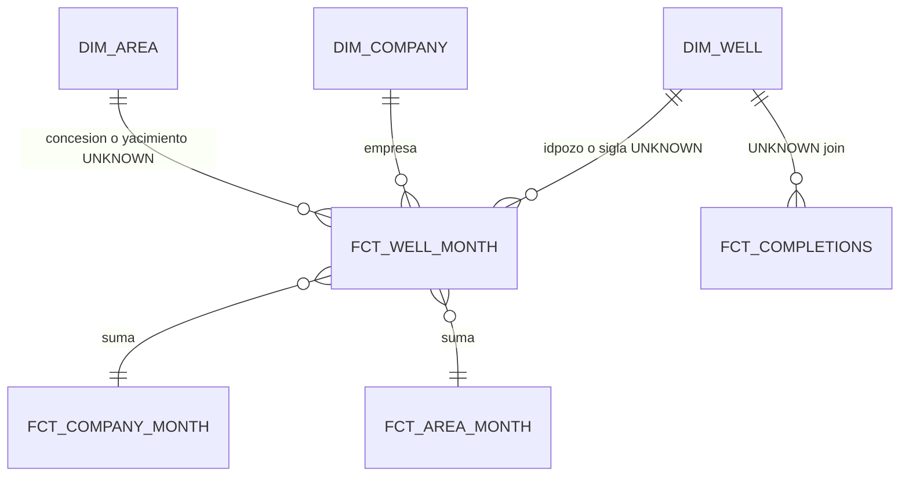

# Data model (draft) — Spec 001

Granos **propuestos** para Vaca Muerta Pulse. Nada de esto está implementado (Hito 0).

Leyenda:

- **CONFIRMED** = documentado por metadatos públicos del Capítulo IV (nombres de campo pueden variar en el CSV anual; Hito 1 confirma).
- **DRAFT** = diseño de producto; falta evidencia en warehouse.
- **UNKNOWN** = no afirmar. Cerrar en Hito 1–2 con sample o marcar no-goal.

Nombres de marts (`fct_*`, `dim_*`) son **DRAFT**.

## Fuentes

| Recurso | Uso | Estado |
| --- | --- | --- |
| Producción de petróleo y gas por pozo (Capítulo IV), CSVs por año / CKAN | Hecho pozo-mes | CONFIRMED que existe; schema exacto del archivo vigente = UNKNOWN hasta el tap |
| Padrón / “Capítulo IV - Pozos” / shapefile | Dimensión pozo, coords | UNKNOWN si hace falta un extract aparte o si viene denormalizado en el CSV de producción |
| Fracturas / intervenciones / completaciones | Hecho de actividad | **UNKNOWN** resource id y grano |
| Consulta avanzada SE (HTML) | No es source de Meltano | Fuera de diseño |

Dataset portal: [energia-produccion-petroleo-gas-por-pozo-capitulo-iv](https://datos.gob.ar/dataset/energia-produccion-petroleo-gas-por-pozo-capitulo-iv). IDs CKAN concretos → Hito 1 / `extraction/README.md`.

### Campos de producción que *esperamos* (CONFIRMED a nivel catálogo histórico; verificar nombres)

| Campo (típico) | Significado | Unidad |
| --- | --- | --- |
| `idpozo` | Pozo **por formación productiva** (no necesariamente = boca) | — |
| `sigla` | Identificador de boca | — |
| `anio`, `mes` | Período de la DDJJ | calendario |
| `prod_pet` | Petróleo | m³ |
| `prod_gas` | Gas | miles de m³ |
| `prod_agua` | Agua | m³ |
| `tef` | Tiempo efectivo de funcionamiento | UNKNOWN unidad exacta (días?) |
| `empresa` | Quién declara | texto |
| `formprod` / `formacion` | Formación | texto |
| `tipo_de_recurso` | Convencional / no convencional | texto |
| `cuenca`, `provincia` | Geo admin | texto |
| `areapermisoconcesion`, `yacimiento` | Área / yacimiento | texto |
| `sub_tipo_recurso` | p.ej. SHALE / TIGHT | UNKNOWN valores actuales |

**UNKNOWN:** si `idpozo` × `anio` × `mes` es único, o hay que incluir `formprod`. Metadatos dicen que `idpozo` es “por formación productiva”.

## Recorte de producto (DRAFT)

Incluir filas donde la formación sea Vaca Muerta **y** el recurso sea no convencional.

**UNKNOWN:**

- String exacto: `VACA MUERTA` vs `vaca muerta` vs códigos.
- ¿`formprod` o `formacion` o ambos?
- ¿`tipo_de_recurso = 'NO CONVENCIONAL'` literal?
- ¿Incluir tight no-VM? **No** en el Pulse v1 (no-goal de cuenca/recurso mixto).

El raw **puede** cargar más amplio; el filtro vive en `stg`/`int`.

## Grano 1 — Pozo-mes (producción)

**Nombre DRAFT:** `fct_well_month`  
**Grano DRAFT:** una fila = un `idpozo` (o `sigla`+formación) × año × mes.

| | |
| --- | --- |
| Clave | UNKNOWN: `idpozo + anio + mes` vs `sigla + formprod + anio + mes` |
| Medidas | `prod_pet_m3`, `prod_gas_km3`, `prod_agua_m3`, `tef` |
| Dims | empresa, área, yacimiento, cuenca, tipo_recurso, coords si existen |
| Partition | DATE `periodo` (primer día del mes) — DRAFT |
| Cluster | `empresa`, identificador de pozo — DRAFT |

**UNKNOWN:** inyecciones (`iny_agua`, etc.) ¿entran al Pulse v1? Propuesta: raw sí, marts de storytelling no (salvo agua de producción).

**UNKNOWN:** DDJJ abierta vs cerrada / rectificativas: ¿última fila gana? Estrategia de dedupe = Hito 1–2.

## Grano 2 — Empresa

**Nombre DRAFT:** `fct_company_month` (hecho) + `dim_company`  
**Grano DRAFT:** empresa × mes, suma del recorte VM.

| | |
| --- | --- |
| Clave empresa | UNKNOWN: texto `empresa` vs `idempresa` vs operador ≠ titular |
| Riesgo | Mismo operador con razones sociales distintas a lo largo del tiempo; **no** hay GLEIF. DRAFT: usar el texto/id del source y documentar quiebres |
| Medidas | producción pet/gas, pozos con producción > 0, UNKNOWN pozos nuevos |

`dim_company` en v1 puede ser DISTINCT del hecho — no un master data externo.

## Grano 3 — Área

**Nombre DRAFT:** `fct_area_month`  
**Grano:** **UNKNOWN** cuál de estas es el “área” del dashboard:

1. `areapermisoconcesion` (permiso / concesión)
2. `yacimiento`
3. `areahabilitada`

**Decisión de producto (DRAFT):** preferir **concesión/permiso** para ranking territorial; yacimiento como drill-down si es barato. Hasta confirmar columnas, el Front no asume nombres.

Clave: id o texto del source × mes. UNKNOWN estabilidad de ids entre años.

## Grano 4 — Completaciones

**Nombre DRAFT:** `fct_completions`  
**Grano:** **UNKNOWN**. Candidatos:

- un job de fractura por pozo y fecha
- una **etapa** (stage) por fila
- un conteo mensual agregado ya publicado

**UNKNOWN:** join a producción (`sigla` vs `idpozo`), campos de arena/agua/presión, si hay dataset 2024–2026 usable.

Hasta Hito 1: no hay mart. Hito 3 muestra empty state si sigue UNKNOWN o se declara no-goal en spec.

## Dimensión pozo

**DRAFT `dim_well`:** `sigla`, `idpozo`, coords, profundidad, tipo de pozo, fecha de primera producción.

**UNKNOWN:** coords `coordenadax`/`coordenaday` a veces están mal etiquetadas en metadatos (lat vs lon). No mapear GIS en v1 sin validar un punto en Neuquén.

## Unidades (CONFIRMED en catálogos; conversión DRAFT)

| Fluido | Source | Marts UI |
| --- | --- | --- |
| Petróleo | m³ | m³; opcional bbl (`× 6.28981077`) — **decidir en Hito 2**, default mostrar m³ + nota |
| Gas | miles de m³ | miles de m³; no mezclar MMscf sin ADR |
| Agua | m³ | m³ |

No convertir en Meltano.

## Relación entre granos (DRAFT)

Agregados empresa/área deben **reconciliar** con la suma del pozo-mes del mismo filtro (test dbt Hito 2). Si no reconcilian, el bug es el grano, no el chart.

## Lo que este archivo no es

- No es un diccionario completo de Capítulo IV.
- No autoriza a inventar `well_id` surrogate opaco sin publicar la regla.
- Cualquier cierre de UNKNOWN se hace **editando este archivo** en el PR que lo descubrió.
