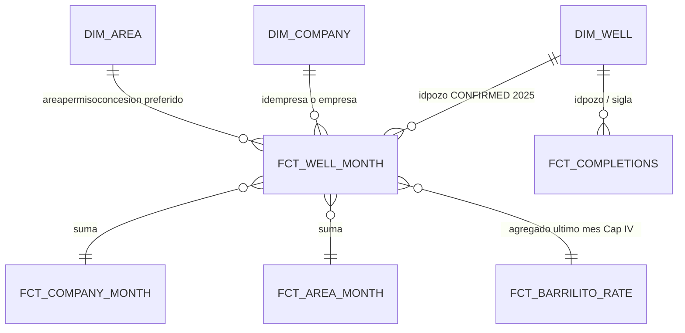

# Data model — Spec 001

Granos para **Barrilito** (repo `vaca-muerta-pulse`). Raw Meltano = Hito 1 (`extraction/`). Marts dbt = Hito 2. Headline UI = Hito 3.

Leyenda:

- **CONFIRMED** = visto en CKAN DataStore (recurso 2025 `d774b5d7-0756-48fe-88f2-8729b57b22da` salvo que se indique otro). Dump: [`extraction/catalogs/`](../../extraction/catalogs/).
- **DRAFT** = diseño de producto; falta evidencia en warehouse / dbt.
- **UNKNOWN** = no afirmar. Cerrar en Hito 2 con tests sobre más años o marcar no-goal.

Nombres de marts (`fct_*`, `dim_*`) siguen **DRAFT** salvo los publicados en Hito 2: **`fct_barrilito_rate`**, **`fct_well_month`**, **`fct_company_month`**, **`dim_company`**, **`fct_area_month`**, **`dim_area`**. El alias `mart_barrilito_headline` no se usa.

Datasets físicos dbt (dev, US, Hito 2 IAM): `stg_cap4_dev` / `int_cap4_dev` / `marts_cap4_dev`. Source raw Hito 2: `raw_cap4_dev`. Detalle: [transform/docs/hito-2-bq-iam.md](../../transform/docs/hito-2-bq-iam.md).

## Fuentes

| Recurso | Uso | Estado |
| --- | --- | --- |
| Producción pozo-mes anual, CKAN DataStore / CSV | Hecho pozo-mes | **CONFIRMED.** Package `produccion-de-petroleo-y-gas-por-pozo`. Default 2025: `d774b5d7-0756-48fe-88f2-8729b57b22da` (total Datastore 991 844 al 2026-09-10). IDs por año: [`extraction/resources/cap4.yml`](../../extraction/resources/cap4.yml) |
| Capítulo IV - Pozos `cb5c0f04-7835-45cd-b982-3e25ca7d7751` | Dim pozo + geojson | **CONFIRMED que existe.** No está en el `meltano run` default (Hito 1). Coords **no** vienen en el anual de producción |
| Padrón primera producción `5578dd48-…` | `(idpozo, anio, mes)` | **CONFIRMED** schema mínimo; no es dim completa |
| Fracturas Adjunto IV `2280ad92-6ed3-403e-a095-50139863ab0d` | Hecho de actividad | **CONFIRMED resource.** ~4890 filas. Stream en el tap, deseleccionado en Hito 1 default |
| Consulta avanzada SE (HTML) | No es source de Meltano | Fuera de diseño |

Dataset portal: [energia-produccion-petroleo-gas-por-pozo-capitulo-iv](https://datos.gob.ar/dataset/energia-produccion-petroleo-gas-por-pozo-capitulo-iv) · origen [datos.energia.gob.ar](https://datos.energia.gob.ar/dataset/produccion-de-petroleo-y-gas-por-pozo).

**Cuidado:** hay clones “con identificador” (p.ej. 2025 `6f9f63bd-…`) con Datastore **truncado** (~90k). No usarlos como extract del año.

### Campos de producción (CONFIRMED en DataStore 2025)

| Campo | Significado | Unidad / tipo CKAN |
| --- | --- | --- |
| `idpozo` | Pozo por formación productiva | integer |
| `sigla` | Identificador de boca | text |
| `anio`, `mes` | Período de la DDJJ | integer |
| `periodo` | Primer día del mes (lo agrega el tap) | DATE `YYYY-MM-01` |
| `prod_pet` | Petróleo | m³ |
| `prod_gas` | Gas | miles de m³ |
| `prod_agua` | Agua | m³ |
| `iny_agua`, `iny_gas`, `iny_co2`, `iny_otro` | Inyecciones | raw sí; marts de storytelling no (salvo agua de producción) |
| `tef` | Tiempo efectivo | **CONFIRMED plausible días** en el recorte Pulse 2025 (warehouse: 0 nulls, min 0, max 31.0, 6115 ceros / 27936 > 0 de 34051 well-months). Cast explícito en Hito 2. Definición oficial / otros años = UNKNOWN |
| `vida_util` | | numeric; uso Pulse = UNKNOWN |
| `empresa`, `idempresa` | Quién declara | text |
| `formprod` | Código formación productiva (p.ej. `PROS`, `FIMP`) | text |
| `formacion` | Nombre formación | text, **minúsculas** en sample (`vaca muerta`) |
| `tipo_de_recurso` | | `CONVENCIONAL` / `NO CONVENCIONAL` / `SIN RESERVORIO` / `NO DISCRIMINADO` |
| `sub_tipo_recurso` | | `SHALE` / `TIGHT` / `''` |
| `cuenca`, `provincia` | Geo admin | text (`NEUQUINA`, …) |
| `idareapermisoconcesion`, `areapermisoconcesion` | Área permiso/concesión | text |
| `idareayacimiento`, `areayacimiento` | Yacimiento | text |
| `tipopozo`, `tipoestado`, `tipoextraccion` | | text |
| `clasificacion`, `subclasificacion`, `proyecto` | | text |
| `profundidad` | | numeric |
| `rectificado`, `habilitado` | flags `t`/`f` | text. 2025: 92 rectificado=`t` vs 991 752 `f` |
| `fechaingreso`, `fecha_data` | timestamps | |
| `observaciones`, `idusuario` | | no van a marts de portada |

No aparece `areahabilitada` en este schema. No aparecen `coordenadax`/`coordenaday` en el anual 2025 (sí en el extract pre-filtrado no-conv `b5b58cdc-…`).

**Clave:** en 2025, `idpozo × anio × mes` tiene **0 duplicados** (query `datastore_search_sql`). Incluir `formprod` no cambia nada: 0 dupes también. **UNKNOWN** si vale para 2006–2024/2026 — test dbt Hito 2.

## Recorte de producto (CONFIRMED strings; filtro en stg)

Incluir filas donde:

- `formacion = 'vaca muerta'` (literal minúsculas; `VACA MUERTA` / `Vaca Muerta` → 0 filas en 2025)
- **y** `tipo_de_recurso = 'NO CONVENCIONAL'`

Conteos 2025 (Datastore SQL):

| sub_tipo_recurso | n |
| --- | --- |
| SHALE | 33 991 |
| TIGHT | 36 |
| `''` | 24 |

Hay 2774 filas `formacion='vaca muerta'` **CONVENCIONAL** — **fuera** del Pulse v1.

Tight no-VM: no-goal (spec). El raw carga **todas las cuencas/años del resource**; el filtro vive en `stg`/`int`.

## Grano 1 — Pozo-mes (producción)

**Nombre (contrato Hito 2):** `fct_well_month`  
**Grano:** una fila = `idpozo` × `anio` × `mes` (CONFIRMED único en 2025).

| | |
| --- | --- |
| Clave | **CONFIRMED 2025:** `idpozo + anio + mes`. UNKNOWN otros años |
| Medidas | `prod_pet`, `prod_gas`, `prod_agua`, `tef` (+ inyecciones en raw) |
| Dims | `empresa` / `idempresa`, `areapermisoconcesion`, `areayacimiento`, `cuenca`, `tipo_de_recurso`, coords solo vía tap pozos |
| Partition raw | **CONFIRMED (loader):** `PARTITION BY TIMESTAMP_TRUNC(_sdc_batched_at, MONTH)` — instante de batch Meltano, **no** el mes de producción |
| Cluster raw | `empresa`, `idpozo`, `cuenca` — cableado en Meltano |
| Grano de negocio | **`periodo`** (DATE `YYYY-MM-01`, lo agrega el tap). `stg` **materializa** `periodo` para filtros/agregados. No usar `_sdc_batched_at` como mes Cap. IV |
| Partition mart `fct_well_month` | **No** `PARTITION BY periodo` en sandbox: el cap de 60 días expira particiones cuya fecha de columna es el mes Cap. IV 2025, y la tabla queda en 0 filas al materializar. Cluster `idempresa, idpozo`. Revisitar partition-by-periodo con billing. |

**Re-emit / rectificativas:** snapshot anual. Prod: `DELETE WHERE anio=@year` + append. Staging **dedupea** `idpozo+anio+mes` (2025 tenía 0 dupes; otros años UNKNOWN): prioriza `rectificado = t`, luego el batch Singer más reciente. El último mes Cap. IV (input de Barrilito) puede **reexpresarse** en un load posterior.

## Grano 2 — Empresa

**Nombre (contrato Hito 2 P1):** `fct_company_month` + `dim_company`  
**Grano:** empresa × mes, suma del recorte Pulse (VM no conv.).

| | |
| --- | --- |
| Clave empresa | **CONFIRMED** `idempresa` + texto `empresa`. Warehouse 2025 Pulse: **24** ids, 1:1 con nombres (0 `idempresa` con más de un string). Estabilidad temporal / operador ≠ titular = UNKNOWN (sin GLEIF; solo 2025 cargado) |
| Clave hecho | `idempresa` × `periodo` (DATE `YYYY-MM-01`). **Sparse:** hay fila solo si el operador tiene al menos un well-month ese mes (no hay date spine ni ceros inventados). Dim = 24 ids en 2025; dic-2025 = 22 company-months |
| Medidas | `prod_pet_m3` / `prod_gas_km3` / `prod_agua_m3`, `tef_sum`, `well_count`, `wells_with_oil` (distinct `idpozo` con petróleo > 0 ese mes). **UNKNOWN** pozos nuevos (no hay padrón de primera producción en el DAG) |
| Source | Solo `fct_well_month`. Front no lee `raw_*` |
| Partition / cluster | **No** `PARTITION BY periodo` en sandbox (mismo cap 60d). Cluster `idempresa` |

`dim_company` = DISTINCT `idempresa` del hecho (`any_value(empresa)`). Test singular falla si un id mapea a más de un nombre.

## Grano 3 — Área

**Nombre (contrato Hito 2 P1):** `fct_area_month` + `dim_area`

Columna `areahabilitada`: **no está** en el anual 2025.

Candidatos que **sí** existen:

1. `areapermisoconcesion` / `idareapermisoconcesion` — **preferido** (columnas CONFIRMED; mart P1 usa este par)
2. `areayacimiento` / `idareayacimiento` — drill-down (no es este mart)

Estabilidad de ids entre años = UNKNOWN (solo 2025 cargado).

| | |
| --- | --- |
| Clave hecho | `idareapermisoconcesion` × `periodo`. Sparse como empresa-mes (981 area-months en 2025 vs 83×12 = 996) |
| Warehouse 2025 Pulse | **83** áreas, 1:1 id/nombre (0 ids con más de un string; 0 blanks) |
| Medidas | mismas sumas que empresa-mes (`prod_*`, `tef_sum`, `well_count`, `wells_with_oil`) + `company_count` |
| Source | Solo `fct_well_month` |
| Partition / cluster | **No** `PARTITION BY periodo` en sandbox. Cluster `idareapermisoconcesion` |

## Grano 4 — Completaciones

**Nombre DRAFT:** `fct_completions`  
**Source CONFIRMED:** Adjunto IV `2280ad92-6ed3-403e-a095-50139863ab0d`.

| | |
| --- | --- |
| Grano | Una fila por `id_base_fractura_adjiv` (job). `cantidad_fracturas` = etapas (CONFIRMED en sample) |
| Join a producción | `idpozo` y `sigla` presentes. Calidad del join = UNKNOWN hasta Hito 2 |
| Arena / agua / presión | `arena_bombeada_*_tn`, `agua_inyectada_m3`, `presion_maxima_psi`, `longitud_rama_horizontal_m` CONFIRMED en schema |
| Fechas | `fecha_inicio_fractura`, `fecha_fin_fractura` |
| Formación | `formacion_productiva` (sample: minúsculas, p.ej. `los molles`) — string exacto VM = UNKNOWN hasta distinct |

Hito 1 **no** carga este stream en el job default. Hito 2 **no** agrega `fct_completions` (no hay tabla raw en el job default). Hito 3 no debe inventar curvas si el mart todavía no existe; empty state. El source ya no es UNKNOWN.

## Grano 5 — Barrilito / headline rate (contrato Hito 2)

Contrato para el contador de portada. **No hay sensores.** La tasa sale del último mes oficial de Capítulo IV (~últimos 30 días de DDJJ), no de telemetría.

**Nombre (contrato Hito 2):** `fct_barrilito_rate`  
**Alias retirado:** `mart_barrilito_headline` — no existe en YAML ni en BQ.

**Grano:** una fila = **un snapshot de producto** para el **último mes Capítulo IV** disponible, agregado al recorte Pulse (**total Vaca Muerta no convencional**, no por empresa ni por pozo). El ranking por `idempresa` / área vive en `fct_company_month` / `fct_area_month`, no en este mart.

| | |
| --- | --- |
| Clave | `periodo` del último mes Cap. IV (una fila). Sin surrogate `as_of_date` (no hizo falta). |
| Recorte | Mismo filtro que el resto del Pulse: `formacion = 'vaca muerta'` y `tipo_de_recurso = 'NO CONVENCIONAL'` (en `stg_produccion_pozo_mes`) |
| Medidas | `prod_pet_m3` (suma), `tef_sum`, `days_in_month`, `rate_m3_dia` / `rate_m3_per_day`, `rate_bbl_dia` / `rate_bbl_per_day`, `rate_method`, frescura (`source_batched_at_max`, `fecha_data_max`), `disclaimer` |
| Partition / cluster | Mart chico (una fila o histórico mensual corto). No heredar la partición raw `_sdc_batched_at` como grano |

### Fórmula (tasa diaria)

Cap. IV trae petróleo en **m³** al mes (source `prod_pet`; en stg/marts: `prod_pet_m3`). Se busca una tasa **por día** para que el Front interpole el contador.

**Preferida** (cuando `tef` es usable como días y `sum(tef) > 0`):

```text
rate_m3_dia = sum(prod_pet_m3) / nullif(sum(tef), 0)
```

Es un promedio **ponderado por tiempo efectivo** sobre el último mes Cap. IV (~30 días de DDJJ), no una ventana rodante de producción horaria. Sample 2025: `tef` *parece* días (31.0 en enero no-conv) — **CONFIRMED plausible**. Warehouse Pulse 2025 (`fct_well_month`, 34051 filas): 0 nulls, min 0, max 31.0, 6115 ceros, 27936 > 0. El modelo **implementa** preferred + fallback (`tef_sum > 0` → `tef_weighted`, si no `calendar_days`) y unit tests con fixtures. Corrida 2026-09-11: headline `rate_method = tef_weighted`. Definición oficial de `tef` como días / otros años sigue **UNKNOWN**.

**Fallback** (si `tef` no es usable):

```text
rate_m3_dia = sum(prod_pet_m3) / days_in_month(periodo)
```

Días de calendario del último mes Cap. IV. Siempre definible; sesga si muchos pozos no produjeron el mes entero.

**Conversión (factor fijo; el mismo en SQL y en YAML de métricas dbt):**

```text
bbl = m³ × 6.28981077
rate_bbl_dia = rate_m3_dia × 6.28981077
```

El Front **no** recalcula el factor. El mart expone `rate_bbl_dia`. `rate_method`: `tef_weighted` | `calendar_days`.

| Método | Estado | Por qué |
| --- | --- | --- |
| `sum(prod_pet_m3) / nullif(sum(tef), 0)` | **Preferido**, cableado (`rate_method = tef_weighted`). Warehouse 2025 Pulse: `tef` en [0, 31], `tef_sum` del headline > 0 | Pondera pozos que realmente “estuvieron on” |
| `sum(prod_pet_m3) / days_in_month` | Fallback cableado (`calendar_days`) | No depende de `tef`; asume el mes calendario lleno |
| Sensores / SCADA / grano horario | **Fuera de diseño** | Cap. IV no lo publica |

### Caveats (no promover a CONFIRMED)

- **Grano mensual:** “~últimos 30 días” = último `periodo` de Capítulo IV, no 30 días móviles de telemetría.
- **`tef` = 0** en abandonados / sin tiempo efectivo: incluirlos en el numerador con petróleo 0 está bien; un `sum(tef) = 0` obliga al fallback. Warehouse 2025 Pulse: **6115** well-months con `tef = 0` (de 34051).
- **Rectificativas / re-emit:** el último mes puede corregirse en un load posterior. El contador sigue al mart, no a un cache eterno.
- **Partición raw vs negocio:** filtrar el mes de producción por `periodo` (stg), nunca por `_sdc_batched_at`.
- **Agregado total:** el headline no es “Barrilito por empresa”. Sumar el recorte Pulse entero.

## Dimensión pozo

**DRAFT `dim_well`:** de producción: `sigla`, `idpozo`, `profundidad`, `tipopozo`. Primera producción: recurso `5578dd48-…`. Coords: `capitulo_iv_pozos.geojson` (EPSG:4326). Validar un punto en Neuquén antes de GIS (Hito 2/3). El anual 2025 **no** trae `coordenadax`/`coordenaday`.

## Unidades (CONFIRMED en catálogo y sample; headline decidido)

Factor petróleo (constante de producto; **el mismo** en marts SQL y en YAML de métricas dbt Hito 2):

```text
bbl = m³ × 6.28981077
```

| Fluido | Source | Marts / UI |
| --- | --- | --- |
| Petróleo | m³ | Headline **Barrilito** default **bbl**. Marts también exponen m³ (tooltip, series, rankings). No un segundo factor. |
| Gas | miles de m³ | miles de m³ |
| Agua | m³ | m³ |

No convertir en Meltano. No convertir en el browser salvo leer `rate_bbl_dia` ya convertida.

## Relación entre granos (DRAFT)



Agregados empresa/área deben **reconciliar** con la suma del pozo-mes del mismo filtro (test dbt Hito 2). `fct_barrilito_rate` debe reconciliar `prod_pet_m3` con esa misma suma del último `periodo` (mismo recorte).

## Lo que este archivo no es

- No es un diccionario completo de Capítulo IV.
- No autoriza a inventar `well_id` surrogate opaco sin publicar la regla.
- No autoriza sensores ni un grano intradía para el contador Barrilito.
- Cualquier cierre de UNKNOWN se hace **editando este archivo** en el PR que lo descubrió.
