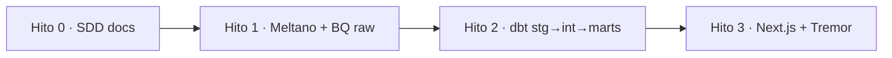

# Plan — Hitos 0–3

Cortes de entrega de [spec.md](spec.md). Aceptación = checklist de QA, no “el branch mergea”.

Código por hito: `docs/specs` → `extraction/` → `transform/` → `apps/web/`. No adelantar el siguiente folder.

---

## Hito 0 — Fundación SDD

**Objetivo:** humanos y agentes navegan el repo sin código de stack.

**Owner:** todos (docs).

**Incluye:** README, AGENTS.md, `docs/`, `specs/001`, placeholders, `.gitignore`.

**No incluye:** `meltano.yml`, `dbt_project.yml`, app Next.

### Aceptación

- [x] README con problema, mermaid de flujo y de layout, tabla de stack, hitos, links a specs.
- [x] AGENTS.md con orden de lectura, SDD, roles, DoD, secretos.
- [x] Architecture C4-ish + ADR 0001.
- [x] Spec 001 con problema, usuarios, requisitos, no-goals, éxito.
- [x] Data-model draft con UNKNOWNs explícitos.
- [x] `tasks.md` de Hito 1 desmarcado.
- [x] Placeholders `extraction/`, `transform/`, `apps/web/` con owner.
- [x] `.gitignore` Python/Node/GCP/dbt/Meltano/`.env`.
- [x] Cero secretos y cero SA JSON.

*(Los checks de Hito 0 se tildan en este plan cuando el PR de fundación existe; las tasks de implementación siguen en [tasks.md](tasks.md).)*

---

## Hito 1 — Raw BigQuery + Meltano

**Objetivo:** Capítulo IV aterriza en `raw_*` de forma reproducible y barata.

**Owner:** DE. **Folder:** `extraction/`. **Tasks:** [tasks.md](tasks.md).

**Incluye:** GCP project, dataset raw, Meltano tap(s) → `target-bigquery`, PARTITION + CLUSTER, env/SA fuera de git, smoke de al menos un año de producción, documentar resource IDs.

**No incluye:** modelos dbt, dashboard, transformación de unidades de negocio (salvo casts del loader).

### Aceptación

- [x] `extraction/` tiene Meltano versionado (`meltano.yml`); README explica `meltano run` y env vars (nombres, no valores). — Meltano + cron gated por `ALLOW_FULL_YEAR_LOAD`; año 2025 corrido en dev
- [x] Existe tabla raw de producción pozo-mes en BQ; **partition** y **cluster** verificables (`INFORMATION_SCHEMA` o console). — MONTH(`_sdc_batched_at`)+CLUSTER `empresa,idpozo,cuenca`; `COUNT(*)` = 991 844
- [x] Load reproducible contra un resource público documentado (URL + id CKAN o patrón de CSV anual). — 2025 `d774b5d7-…`; append `overwrite:false` + `--recreate` en sandbox
- [x] Conteos de smoke: filas del sample vs source (tolerancia y duplicados documentados). — Datastore 991 844 vs BQ 991 844 (delta 0)
- [ ] Completaciones: **o** tabla raw + source documentado, **o** `data-model.md` actualizado a “sin source en v1” (no silenciar el UNKNOWN). — source Adjunto IV documentado; tabla raw no cargada (job default, deseleccionado)
- [x] Ningún secreto en el PR; presupuesto/alerta GCP mencionada en `extraction/README.md`. — docs sí; sandbox 60 días de expiración documentado
- [x] `data-model.md`: columnas reales del tap reemplazan la lista draft donde haya evidencia. — hecho vía DataStore + COUNT BQ del año

---

## Hito 2 — dbt `stg` → `int` → `marts`

**Objetivo:** granos de producto testeados, listos para UI.

**Owner:** AE. **Folder:** `transform/`.

**Incluye:** sources sobre raw, staging (rename, types, filtro VM), intermediate (claves, unidades), marts de [data-model.md](data-model.md), tests.

**No incluye:** Meltano nuevo salvo un bug de contrato; UI.

### Aceptación

- [ ] `dbt_project.yml` + `stg` / `int` / `marts` (nombres alineados al data-model).
- [ ] Tests `unique`/`not_null` en claves de `fct_well_month` (o nombre final).
- [ ] Filtro VM no convencional aplicado en `stg` o `int` y documentado (strings confirmados).
- [ ] Marts de empresa y área; grano de área ya no UNKNOWN (o P1 explícito).
- [ ] Completaciones: mart **o** no-goal actualizado en spec.
- [ ] `dbt test` verde en CI o instrucciones locales inequívocas.
- [ ] Front puede basarse en nombres de marts documentados (contrato en data-model).

---

## Hito 3 — Dashboard Next.js + Tremor

**Objetivo:** storytelling público que cumple R6–R10 de la spec.

**Owner:** Front. **Folder:** `apps/web/`.

**Incluye:** app Next, Tremor, lectura de marts (server / cache), copy en español.

**No incluye:** redefinir granos en el cliente; queries a `raw_*`.

### Aceptación

- [ ] Portada con KPIs y serie temporal del recorte VM.
- [ ] Ranking de empresas y al menos una vista de área.
- [ ] Completaciones visibles **o** empty state honesto.
- [ ] Unidades en UI; no números huérfanos.
- [ ] Sin credenciales en el bundle del cliente.
- [ ] README de `apps/web/` con cómo correr y de qué marts depende.
- [ ] Recorrido manual (o e2e mínimo) cubre portada + un filtro.

---

## Dependencias y riesgos

| Riesgo | Hito | Mitigación |
| --- | --- | --- |
| CKAN/CSV cambia de schema | 1 | Staging flexible; data-model se actualiza en el PR |
| Grano pozo ≠ formación | 1–2 | UNKNOWN en data-model; no forzar unique(sigla, mes) si es falso |
| Fracturas incruzables | 2–3 | UI empty + spec; no interpolar |
| Costo BQ | 1–3 | Partition + cluster + lecturas de marts chicos |
| Scope creep GIS/auth | 3 | No-goals |

Después de Hito 3, una spec `002` (API, mapa, más cuencas) — no inflar 001.
