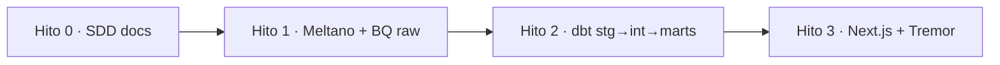

# Plan — Hitos 0–3

Cortes de entrega de [spec.md](spec.md). Aceptación = checklist de QA, no “el branch mergea”.

Código por hito: `docs/specs` → `extraction/` → `transform/` → `apps/web/`. No adelantar el siguiente folder.

Producto UI: **Barrilito** (repo `vaca-muerta-pulse`). El contador “live” es simulación interpolada desde un mart **bbl/día** mensual — ver [spec.md](spec.md) y [data-model.md](data-model.md).

---

## Hito 0 — Fundación SDD

**Objetivo:** humanos y agentes navegan el repo sin código de stack.

**Owner:** todos (docs).

**Incluye:** README, AGENTS.md, `docs/`, `specs/001`, placeholders, `.gitignore`.

**No incluye:** `meltano.yml`, `dbt_project.yml`, app Next.

### Aceptación

- [x] README con problema, mermaid de flujo y de layout, tabla de stack, hitos, links a specs.
- [x] AGENTS.md con orden de lectura, SDD, roles, DoD, secretos.
- [x] Architecture C4-ish + ADR 0001.
- [x] Spec 001 con problema, usuarios, requisitos, no-goals, éxito.
- [x] Data-model draft con UNKNOWNs explícitos.
- [x] `tasks.md` de Hito 1 desmarcado.
- [x] Placeholders `extraction/`, `transform/`, `apps/web/` con owner.
- [x] `.gitignore` Python/Node/GCP/dbt/Meltano/`.env`.
- [x] Cero secretos y cero SA JSON.

*(Los checks de Hito 0 se tildan en este plan cuando el PR de fundación existe; las tasks de implementación siguen en [tasks.md](tasks.md).)*

---

## Hito 1 — Raw BigQuery + Meltano

**Objetivo:** Capítulo IV aterriza en `raw_*` de forma reproducible y barata.

**Owner:** DE. **Folder:** `extraction/`. **Tasks:** [tasks.md](tasks.md).

**Incluye:** GCP project, dataset raw, Meltano tap(s) → `target-bigquery`, PARTITION + CLUSTER, env/SA fuera de git, smoke de al menos un año de producción, documentar resource IDs. Cadencia de extract **mensual** (publicación Capítulo IV).

**No incluye:** modelos dbt, dashboard, conversión m³ → bbl (eso es Hito 2), schedule sub-diario o taps de sensores. **No cambiar** `meltano.yml` en un PR de producto/marca.

### Aceptación

- [x] `extraction/` tiene Meltano versionado (`meltano.yml`); README explica `meltano run` y env vars (nombres, no valores). — Meltano + cron gated por `ALLOW_FULL_YEAR_LOAD`; año 2025 corrido en dev
- [x] Existe tabla raw de producción pozo-mes en BQ; **partition** y **cluster** verificables (`INFORMATION_SCHEMA` o console). — MONTH(`_sdc_batched_at`)+CLUSTER `empresa,idpozo,cuenca`; `COUNT(*)` = 991 844
- [x] Load reproducible contra un resource público documentado (URL + id CKAN o patrón de CSV anual). — 2025 `d774b5d7-…`; append `overwrite:false` + `--recreate` en sandbox
- [x] Conteos de smoke: filas del sample vs source (tolerancia y duplicados documentados). — Datastore 991 844 vs BQ 991 844 (delta 0)
- [ ] Completaciones: **o** tabla raw + source documentado, **o** `data-model.md` actualizado a “sin source en v1” (no silenciar el UNKNOWN). — source Adjunto IV documentado; tabla raw no cargada (job default, deseleccionado)
- [x] Ningún secreto en el PR; presupuesto/alerta GCP mencionada en `extraction/README.md`. — docs sí; sandbox 60 días de expiración documentado
- [x] `data-model.md`: columnas reales del tap reemplazan la lista draft donde haya evidencia. — hecho vía DataStore + COUNT BQ del año

---

## Hito 2 — dbt `stg` → `int` → `marts`

**Objetivo:** granos de producto testeados, listos para UI — incluida la tasa Barrilito en **bbl/día**.

**Owner:** AE. **Folder:** `transform/`.

**Incluye:** sources sobre raw, staging (rename, types, filtro VM; materializar `periodo` como grano de negocio), intermediate (claves, unidades), marts de [data-model.md](data-model.md) **incluido** el mart DRAFT de headline (`fct_barrilito_rate` / `mart_barrilito_headline`), tests, factor `bbl = m³ × 6.28981077` en SQL **y** en YAML de métricas.

**Ops BQ (2026-09-10):** datasets US `stg_cap4_dev` / `int_cap4_dev` / `marts_cap4_dev` **existen**. `raw_cap4_dev` existe; `raw_cap4` no. SA `vm-pulse-dbt` **creada por Nico**; bindings OK (`jobUser` + READER raw / WRITER stg-int-marts). Secret `GCP_SA_KEY_DBT`. Evidencia: [transform/docs/hito-2-bq-iam.md](../../transform/docs/hito-2-bq-iam.md).

**No incluye:** Meltano nuevo salvo un bug de contrato; UI; sensores ni grano intradía; convertir en el tap.

### Aceptación

- [x] `dbt_project.yml` + `stg` / `int` / `marts` (nombres alineados al data-model). — `stg_produccion_pozo_mes`, `int_produccion_vm_noconv`, `fct_well_month`, `fct_barrilito_rate`, `fct_company_month`, `dim_company`, `fct_area_month`, `dim_area`
- [x] Tests `unique`/`not_null` en claves de `fct_well_month` (YAML; corren con warehouse).
- [x] Filtro VM no convencional aplicado en `stg` y documentado (strings confirmados).
- [x] Marts de empresa y área; grano de área ya no UNKNOWN (o P1 explícito). — `fct_company_month` + `dim_company` (grano `idempresa+periodo`); `fct_area_month` + `dim_area` (grano preferido `idareapermisoconcesion+periodo`). Estabilidad de ids entre años = UNKNOWN (solo 2025).
- [x] Completaciones: mart **o** no-goal actualizado en spec. — **sin mart** (Adjunto IV no está en el job Meltano default); Hito 3 empty state. Source documentado.
- [x] **Mart Barrilito:** `fct_barrilito_rate`, una fila = snapshot VM no conv. último mes Cap. IV (total Pulse). Tasa **bbl/día**.
- [x] **Fórmula** en modelo + data-model: preferred `sum(prod_pet_m3) / nullif(sum(tef), 0)`; fallback `days_in_month`. Unit tests fixtures `tef = 0`. Warehouse 2025 Pulse: `tef` en [0, 31], 0 nulls; headline `tef_weighted`.
- [x] Conversión `bbl = m³ × 6.28981077` en el mart **y** en YAML de métricas (mismo factor).
- [x] `stg` usa `periodo`. No tratar `_sdc_batched_at` como mes de producción.
- [x] `dbt test` verde en CI o instrucciones locales inequívocas. — CI: `dbt deps` + `dbt parse`. Warehouse 2026-09-11: `dbt build --select +fct_barrilito_rate` PASS=33 y `dbt test` PASS=29 contra `raw_cap4_dev` (SA `vm-pulse-dbt`). `fct_barrilito_rate` 1 fila.
- [x] Front puede basarse en nombres de marts documentados (`transform/README.md` + data-model), incluida la tasa Barrilito y los rankings empresa/área.

---

## Hito 3 — Dashboard Next.js + Tremor

**Objetivo:** storytelling público **Barrilito** que cumple R6–R10 de la spec.

**Owner:** Front. **Folder:** `apps/web/`.

**Incluye:** app Next, Tremor, lectura de marts (server / cache), copy en español, contador interpolado + disclaimer MUST.

**No incluye:** redefinir granos en el cliente; queries a `raw_*`; telemetría; afirmar alta frecuencia.

### Aceptación

- [ ] Portada **Barrilito:** headline = contador de barriles interpolado desde `bbl/día` del mart (último mes Cap. IV), con aspecto “extrayéndose” en vivo.
- [ ] Disclaimer **MUST** visible junto al contador: *simulación a partir de datos mensuales oficiales*. Sin ese texto, la portada no acepta.
- [ ] Copy no afirma sensores, SCADA ni que Capítulo IV sea tiempo real / intradía.
- [ ] KPIs y serie temporal del recorte VM además del headline.
- [ ] Ranking de empresas y al menos una vista de área.
- [ ] Completaciones visibles **o** empty state honesto.
- [ ] Unidades en UI; headline petróleo en **bbl**; no números huérfanos.
- [ ] Sin credenciales en el bundle del cliente.
- [ ] README de `apps/web/` con cómo correr, de qué marts depende (incl. tasa Barrilito) y el disclaimer.
- [ ] Recorrido manual (o e2e mínimo) cubre portada (contador + disclaimer) + un filtro.

---

## Dependencias y riesgos

| Riesgo | Hito | Mitigación |
| --- | --- | --- |
| CKAN/CSV cambia de schema | 1 | Staging flexible; data-model se actualiza en el PR |
| Grano pozo ≠ formación | 1–2 | UNKNOWN en data-model; no forzar unique(sigla, mes) si es falso |
| `tef` no usable (ceros, no-días) | 2 | Fallback `days_in_month`; tests; no promover UNKNOWN a CONFIRMED |
| Contador se lee como telemetría | 3 | Disclaimer MUST; no-goal de alta frecuencia |
| Fracturas incruzables | 2–3 | UI empty + spec; no interpolar completaciones |
| Costo BQ | 1–3 | Partition + cluster + lecturas de marts chicos |
| Scope creep GIS/auth | 3 | No-goals |

Después de Hito 3, una spec `002` (API, mapa, más cuencas) — no inflar 001.
