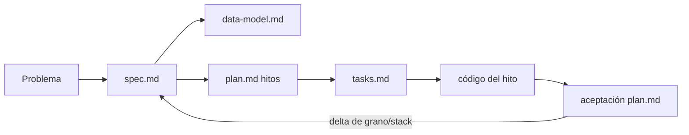

# Specs — cómo funcionan en este repo

Este repo es **spec-driven** (SDD): la spec se actualiza **antes** (o en el mismo PR, primero en el diff) de código grande. Los agentes empiezan por [AGENTS.md](../AGENTS.md).

## Qué es una spec

Una carpeta `specs/NNN-slug/` describe **un producto o un cambio de producto**, no un ticket aislado.

| Archivo | Contenido |
| --- | --- |
| `spec.md` | Problema, usuarios, requisitos, no-goals, éxito |
| `plan.md` | Hitos y aceptación |
| `data-model.md` | Granos, claves, UNKNOWNs |
| `tasks.md` | Checklist Hito 1 (año 2025 en `raw_cap4_dev`) + Hito 2 (IAM + dbt Barrilito) + notas Hito 3 |

Opcional más adelante: `research.md`, `contracts.md` (APIs). No inventar archivos vacíos.

## Flujo de trabajo

1. Si el trabajo **cambia** usuarios, alcance o métricas → `spec.md`.
2. Si cambia grano, fuente o columnas → `data-model.md` (cerrar UNKNOWN con evidencia).
3. Si cambia el corte de hitos → `plan.md`.
4. Implementación: tachar `tasks.md`; no agregar Next fuera del Hito 3.
5. Stack → [docs/adrs/](../docs/adrs/README.md), no un párrafo suelto en un modelo.

## Specs activas

| ID | Producto | Estado |
| --- | --- | --- |
| [001-vaca-muerta-pulse](001-vaca-muerta-pulse/spec.md) | **Barrilito** (repo `vaca-muerta-pulse`) — Cap. IV, simulación mensual | Activa · Hito 2 (dbt; año 2025 en `raw_cap4_dev`; `dbt build` BQ pide SA) |

## Convenciones

- IDs: `001`, `002`, … sin reusar.
- Español para relato de producto; identificadores técnicos en inglés (`fct_well_month`).
- **UNKNOWN** en mayúsculas cuando el source no está confirmado. Prohibido rellenar con “supongo que idpozo es único”.
- Un PR de Hito 1 no abre `002-…` salvo un corte de producto real.

## Relación con el código

| Código | Spec que debe coincidir |
| --- | --- |
| `extraction/` | plan Hito 1 + tasks + architecture raw |
| `transform/` | data-model + plan Hito 2 |
| `apps/web/` | spec requisitos de UI + plan Hito 3 |
